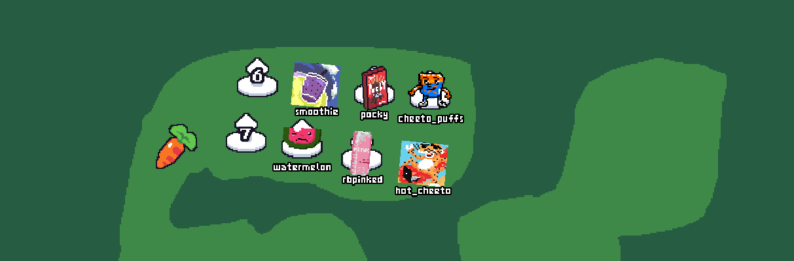

# 🏇🏿 COGS Pixel Race

Recreation of the [horse race tests](https://tvtropes.org/pmwiki/pmwiki.php/WebOriginal/HorseRaceTests)!

## Developing

- Open up `game` in Godot
- Download the `godot-cpp` submodule using

```bash
git submodule update --recursive
```

- Build the C++ `GDExtension` code using

```bash
scons
```